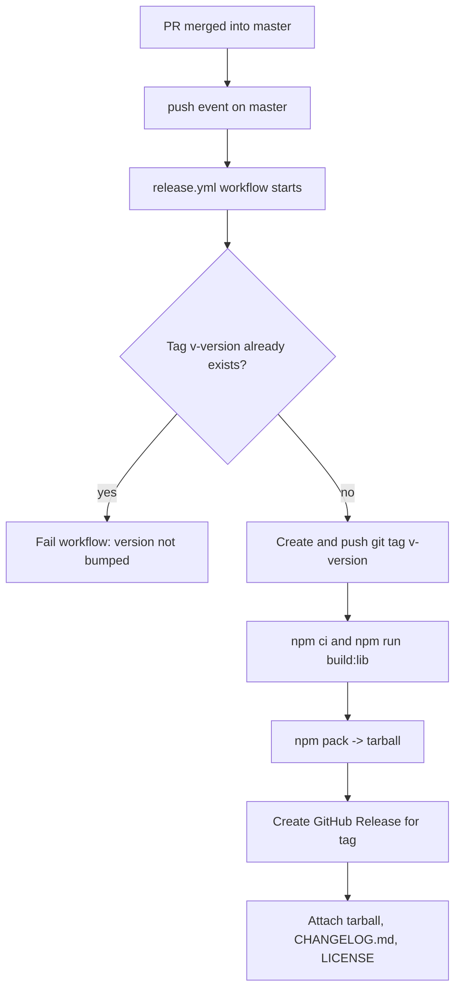

# Requirements

### Overview & Goals
Prepare `runway-grid` for its first release-candidate cut by adding release-management scaffolding: a changelog documenting everything shipped so far, a consistent `1.0.0-rc0` version across every manifest, author attribution for Maximilian Both, and a GitHub Actions pipeline that automatically tags and releases every merge to `master`.

### Scope
**In scope:**
- `CHANGELOG.md` at the repo root, Keep-a-Changelog style, with a `v1.0.0-rc0` entry summarizing the project's history so far (from `feat: first commit` through the accessibility/rangechange-batching work).
- Version bump to `1.0.0-rc0` in `package.json`, `package-lock.json`, `runway_engine/Cargo.toml`, and `runway_engine/Cargo.lock`.
- Author metadata (`Maximilian Both <maximilian.both27@outlook.com>`) added to `package.json` (`author` field), `runway_engine/Cargo.toml` (`authors`), the `LICENSE` copyright line, and a short "Author" note in `README.md`.
- A single GitHub Actions workflow (`.github/workflows/release.yml`) that, on every push to `master`: reads the version from `package.json`, fails fast if a tag for that version already exists (i.e. every merge to `master` must carry a version bump), otherwise creates+pushes a `v<version>` tag, builds the library, packages it with `npm pack` plus `CHANGELOG.md`/`LICENSE`, and publishes a GitHub Release with those files attached.

**Out of scope:**
- Publishing to the npm registry (`npm publish`) - not requested, and would need an `NPM_TOKEN` secret.
- Any CI workflow for pull requests (running tests/typecheck/build on PRs) - not requested; this task is specifically about the merge-to-`master` release pipeline.

**Update (follow-up):** Rebuilding the Rust/WASM engine in CI is now **in scope** - the workflow runs `npm run build:engine` (which wraps `build:wasm`/`wasm-pack build` and `build:wasm-base64`) before `build:lib`, so every release always packages a freshly compiled `runway_engine` instead of relying on the previously committed `src/runway-engine-wasm.js`. This requires installing the Rust toolchain (`wasm32-unknown-unknown` target) and `wasm-pack` in the job.

### User Stories
- As a maintainer, I want a `CHANGELOG.md` so contributors and users can see what changed release-to-release without digging through commit history.
- As a maintainer, I want every manifest to agree on the same version number so there's no ambiguity about what "1.0.0-rc0" actually refers to.
- As a maintainer, I want merging to `master` to automatically tag and publish a GitHub Release with the built package attached, so I never have to do it by hand and never forget a step.

### Functional Requirements
- `CHANGELOG.md` follows the `## [1.0.0-rc0] - <date>` heading convention with `### Added`/`### Changed`/`### Fixed` subsections summarizing the work already done.
- `package.json`, `package-lock.json`, `runway_engine/Cargo.toml`, and `runway_engine/Cargo.lock` all report version `1.0.0-rc0` consistently.
- `package.json` has an `author` field; `runway_engine/Cargo.toml` has an `authors` array; `LICENSE`'s copyright line and `README.md` both name Maximilian Both with the given email.
- Pushing to `master` with a version that hasn't been tagged yet results in a new `v<version>` git tag and a GitHub Release containing the `npm pack` tarball, `CHANGELOG.md`, and `LICENSE`.
- Pushing to `master` without a version bump (tag already exists) fails the workflow run with a clear error, rather than silently doing nothing or erroring on a duplicate tag/release.

# Technical Design

### Current Implementation
- `package.json` (root): `"version": "0.1.0"`, no `author`/`repository`/`homepage` fields. Its `"files"` array (`["dist", "README.md", "LICENSE"]`) already controls what `npm pack`/`npm publish` would include.
- `runway_engine/Cargo.toml`: `[package] name = "runway_engine" version = "0.1.0"`, no `authors`. `runway_engine/Cargo.lock` has a matching self-referencing `version = "0.1.0"` entry for the same package.
- `LICENSE`: standard Apache-2.0 text ending in the boilerplate `Copyright 2026 runway-grid contributors` notice.
- No `CHANGELOG.md` and no `.github/` directory exist yet (confirmed via search).
- Git remote is `https://github.com/maximilian27/RunwayGrid.js.git`, default branch `master`, no tags exist yet.
- Build pipeline: `npm run build:lib` = `vite build --config vite.lib.config.js && npm run build:types`, entry `src/index.js` -> imports the **already-committed** `src/runway-engine-wasm.js` (base64-embedded compiled WASM). This means CI does **not** need Rust/`wasm-pack`/`cargo` at all to build a releasable `dist/` - plain `npm ci && npm run build:lib` is sufficient.

### Key Decisions
1. **Single combined workflow, not two chained workflows.** GitHub's default `GITHUB_TOKEN` cannot trigger a second workflow from a tag it just pushed (loop protection), so a literal "tag workflow" + "release workflow" pair would need either a PAT secret or a `workflow_run` chain. The user chose the simplest, most reliable option: one workflow (`release.yml`) triggered on `push: branches: [master]` that performs tag-then-release as sequential steps in a single job.
2. **Fail on an unchanged version.** If `package.json`'s version has already been tagged, the workflow step that checks `git rev-parse -q --verify refs/tags/v<version>` exits non-zero and fails the run (via `exit 1`), rather than skipping quietly. This enforces "every merge to `master` must include a version bump" as a hard rule, surfaced immediately in the Actions UI.
3. **Release assets: `npm pack` tarball + docs.** The release attaches exactly what would be published to npm (`npm pack` respects `package.json`'s `"files"` array: `dist/`, `README.md`, `LICENSE`), plus `CHANGELOG.md` separately (since it's documentation, not library code, and won't be added to `"files"`).
4. **Version source of truth is `package.json`.** `runway_engine/Cargo.toml` is kept in sync manually as part of this change (and future manual bumps), but the workflow only reads `package.json`'s version for tagging/release naming, since that's what actually gets published/packed.
5. **Rebuild the Rust/WASM engine in CI (follow-up decision).** Rather than trusting the committed `src/runway-engine-wasm.js`, the workflow now installs the Rust toolchain (`dtolnay/rust-toolchain@stable` with the `wasm32-unknown-unknown` target) and `wasm-pack` (`jetli/wasm-pack-action@v0.4.0`), plus `Swatinem/rust-cache@v2` for build caching, then runs `npm run build:engine` before `npm run build:lib`. This guarantees every release ships the latest compiled Rust code, not a stale, manually-regenerated base64 blob.

### Proposed Changes

**`CHANGELOG.md` (new file):**
```markdown

# Changelog

All notable changes to this project will be documented in this file.

The format is based on [Keep a Changelog](https://keepachangelog.com/en/1.0.0/),
and this project adheres to [Semantic Versioning](https://semver.org/).

## [1.0.0-rc0] - 2026-XX-XX

### Added
- Initial `<runway-grid>` custom element: virtualized vertical lists, horizontal lists, and 2D grids backed by a Rust/WebAssembly layout engine (`runway_engine`), with the compiled WASM embedded as base64 for zero-config installs.
- Infinite-scroll support: `appendData()`/`removeDataFromHead()` for both vertical and horizontal orientations, including a memory-capped "sliding window" pattern.
- Full accessibility support: `role="grid"`/`"row"`/`"gridcell"` for `orientation="both"`, `role="list"`/`"listitem"` for single-axis orientations, with ARIA counts/positions kept in sync with the true dataset size (not just mounted DOM nodes).
- A `<noscript>`-based SEO/crawler fallback pattern, documented in the README.
- A full demo site (`demo/`) covering all seven usage patterns, with light/dark theming (system-based, with a manual override toggle) and a syntax-highlighted "Code" tab per example.
- Playwright e2e test suite covering virtualization, scroll-to-index/cell, append/remove data, and accessibility.

### Changed
- Renamed all internal `.virtual-scroll__*` CSS classes to `.runway-grid__*` for naming consistency with the public element name.
- Batched `rangechange` event dispatch so a single public API call (e.g. `scrollToCell()`) never fires more than one event per invocation.
- `_onWheel` now only calls `preventDefault()` on axes that have room to scroll, allowing scroll-chaining into a parent scrollable container at the grid's bounds.

### Fixed
- Removed a global `window.history.scrollRestoration` mutation on module import.
- WASM init failures are now caught and surfaced via a `wasmerror` event instead of an unhandled rejection.
- Fixed a light/dark theme flash on navigation in the demo site (missing `<meta name="color-scheme">`).
- Keyboard navigation (Page Up/Down, Home/End, arrows) no longer hijacks keystrokes from interactive elements (inputs/buttons) nested inside cells.
```
(Exact wording/grouping may be refined, but will cover this set of changes pulled from the actual git history.)

**Version bump (four files):**
- `package.json`: `"version": "1.0.0-rc0"`.
- `package-lock.json`: both the top-level `"version"` and the `""` (root) package entry's `"version"`, updated in lockstep with `package.json` (via `npm version 1.0.0-rc0 --no-git-tag-version`, which updates both files consistently without creating a git tag itself - tagging is the workflow's job).
- `runway_engine/Cargo.toml`: `version = "1.0.0-rc0"` (Cargo accepts semver pre-release identifiers like this natively).
- `runway_engine/Cargo.lock`: the matching self-referencing `runway_engine` package entry's `version`, updated via `cargo update -p runway_engine --precise 1.0.0-rc0` (or manual edit if `cargo` isn't available in this environment).

**Author metadata (four files):**
- `package.json`: add `"author": { "name": "Maximilian Both", "email": "maximilian.both27@outlook.com" }`.
- `runway_engine/Cargo.toml`: add `authors = ["Maximilian Both <maximilian.both27@outlook.com>"]` under `[package]`.
- `LICENSE`: update the boilerplate copyright line to `Copyright 2026 Maximilian Both`.
- `README.md`: add a short "Author" line (e.g. under/near the License section) naming Maximilian Both with the email, as a mailto link.

**New workflow - `.github/workflows/release.yml`:**
```yaml
name: Release
on:
  push:
    branches: [master]
permissions:
  contents: write
jobs:
  release:
    runs-on: ubuntu-latest
    steps:
      - uses: actions/checkout@v4
        with: { fetch-depth: 0 }
      - uses: actions/setup-node@v4
        with: { node-version: 20 }
      - name: Read version
        id: version
        run: echo "version=$(node -p \"require('./package.json').version\")" >> "$GITHUB_OUTPUT"
      - name: Fail if tag already exists
        run: |
          if git rev-parse -q --verify "refs/tags/v${{ steps.version.outputs.version }}" >/dev/null; then
            echo "::error::Tag v${{ steps.version.outputs.version }} already exists - bump package.json's version before merging to master."
            exit 1
          fi
      - name: Create and push tag
        run: |
          git tag "v${{ steps.version.outputs.version }}"
          git push origin "v${{ steps.version.outputs.version }}"
      - run: npm ci
      - run: npm run build:lib
      - name: Package release assets
        run: npm pack   # produces runway-grid-<version>.tgz per package.json's "files"
      - name: Create GitHub Release
        uses: softprops/action-gh-release@v2
        with:
          tag_name: v${{ steps.version.outputs.version }}
          files: |
            runway-grid-${{ steps.version.outputs.version }}.tgz
            CHANGELOG.md
            LICENSE
```
(Exact step list/action versions may be adjusted during implementation, but the shape - single job, fail-fast tag check, tag+push, `npm ci && npm run build:lib`, `npm pack`, then `softprops/action-gh-release` - is fixed by the decisions above.)

### File Structure
```
CHANGELOG.md                        (new)
.github/
  workflows/
    release.yml                     (new)
package.json                        (modified: version, author)
package-lock.json                   (modified: version, in sync)
LICENSE                             (modified: copyright line)
README.md                           (modified: author note)
runway_engine/
  Cargo.toml                        (modified: version, authors)
  Cargo.lock                        (modified: version, in sync)
```

### Architecture Diagram


### Risks
- **`cargo`/Rust toolchain may not be available** in this environment to regenerate `Cargo.lock`'s version entry automatically; if so, the version field will be edited directly in `Cargo.lock` to match `Cargo.toml` (a one-line, low-risk manual edit for a version-only bump with no dependency graph changes).
- **`softprops/action-gh-release`** is a well-known third-party action; if repository policy requires only first-party actions, the release-creation step can be swapped for the `gh release create` CLI (bundled on `ubuntu-latest` runners) using the default `GITHUB_TOKEN` - functionally equivalent, called out here so it's a quick swap if needed.
- **`permissions: contents: write`** must be set on the workflow (shown above) - without it, the default `GITHUB_TOKEN` cannot push tags or create releases.

# Delivery Steps

### ✓ Step 1: Add CHANGELOG.md with the v1.0.0-rc0 entry
A new `CHANGELOG.md` exists at the repo root summarizing everything shipped so far under a `[1.0.0-rc0]` heading.
- Create `CHANGELOG.md` using the Keep a Changelog format/header.
- Add a `## [1.0.0-rc0] - <date>` section with `### Added`/`### Changed`/`### Fixed` subsections, summarizing the project's git history (initial virtualized list/grid + WASM engine, infinite scroll and sliding window support, accessibility overhaul, class renaming, theme flicker fix, error handling improvements, demo site).
- Cross-check the summary against `git log` so no notable change is missed or misattributed.

### ✓ Step 2: Bump version to 1.0.0-rc0 across all manifests
`package.json`, `package-lock.json`, `runway_engine/Cargo.toml`, and `runway_engine/Cargo.lock` all consistently report version `1.0.0-rc0`.
- Update `package.json`'s `"version"` field to `"1.0.0-rc0"`.
- Update `package-lock.json`'s top-level and root (`""`) package `"version"` fields to match (keeping the lockfile internally consistent with `package.json`).
- Update `runway_engine/Cargo.toml`'s `version = "0.1.0"` to `version = "1.0.0-rc0"`.
- Update the matching `runway_engine` self-entry version in `runway_engine/Cargo.lock` to stay in sync with `Cargo.toml`.

### ✓ Step 3: Add author metadata to package manifests, LICENSE, and README
`Maximilian Both <maximilian.both27@outlook.com>` is attributed as the author in every relevant metadata file.
- Add an `"author": { "name": "Maximilian Both", "email": "maximilian.both27@outlook.com" }` field to `package.json`.
- Add `authors = ["Maximilian Both <maximilian.both27@outlook.com>"]` to `runway_engine/Cargo.toml`'s `[package]` section.
- Update the `LICENSE` file's boilerplate copyright line (`Copyright 2026 runway-grid contributors`) to name Maximilian Both.
- Add a short "Author" note (name + mailto link) to `README.md`, near the existing License section.

### ✓ Step 4: Create the merge-to-master release GitHub Actions workflow
A new `.github/workflows/release.yml` workflow automatically tags and releases every push to `master`.
- Create `.github/workflows/release.yml` triggered on `push` to the `master` branch, with `permissions: contents: write`.
- Add a step that reads the version from `package.json` and fails the run if a `v<version>` tag already exists (enforcing a version bump on every merge to `master`).
- Add steps that create and push the `v<version>` git tag, then run `npm ci` and `npm run build:lib` to produce `dist/`.
- Add a step that runs `npm pack` to produce the publishable tarball (per `package.json`'s `"files"` list), then create a GitHub Release for the new tag attaching the tarball, `CHANGELOG.md`, and `LICENSE`.

### ✓ Step 5: Rebuild the Rust/WASM engine in the release workflow
The release workflow always compiles the latest `runway_engine` Rust source instead of relying on the previously committed base64 WASM module.
- Add `dtolnay/rust-toolchain@stable` (with the `wasm32-unknown-unknown` target) and `Swatinem/rust-cache@v2` steps to `.github/workflows/release.yml`, before the Node build steps.
- Add `jetli/wasm-pack-action@v0.4.0` to install `wasm-pack` on the runner.
- Add a `npm run build:engine` step (runs `build:wasm` + `build:wasm-base64`) right after `npm ci` and before `npm run build:lib`, so `dist/` is built from a freshly regenerated `src/runway-engine-wasm.js`.