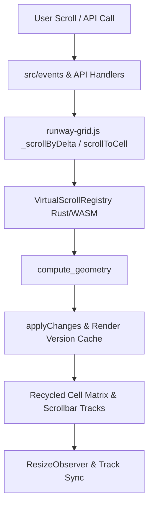

# Requirements

### Overview & Goals
The primary goal is to maximize total system utility, user satisfaction, and runtime efficiency by resolving all critical defects, memory leaks, API inconsistencies, and performance bottlenecks identified in the core review of `<runway-grid>`, culminating in a robust `1.0.0-rc2` release.

By eliminating resource leaks in WebAssembly and the DOM, repairing broken scrolling primitives in Firefox and horizontal orientations, and standardizing developer ergonomics (such as read/write symmetry and unified horizontal data assignment), we maximize developer productivity and provide a flawless end-user experience.

### Scope
#### In Scope
- **Index Snapping & Clamping:** Fix `scrollToCell` index snapping bug that prevents scrolling to index `1` and `count - 2`.
- **Horizontal Single-Axis Scrolling:** Fix `scrollToIndex` for `orientation="horizontal"`.
- **Render Cache Invalidation:** Resolve stale cell rendering on `data`, `columns`, or `template` reassignments.
- **Cross-Browser Wheel Scrolling:** Normalize `deltaMode` in `wheel.js` and remove arbitrary `0.3` dampener so wheel navigation works reliably in Firefox and Windows line-delta mice.
- **Lifecycle & Memory Management:** Eliminate WASM linear heap leaks by freeing `VirtualScrollRegistry` on reassignment and unmount; disconnect `ResizeObserver`s; manage window `mouseup` listener exclusively during element attachment.
- **API Symmetry & Ergonomics:** Provide `get data()` and `get columns()`; make horizontal mode accept `data` directly; trigger registry setup on `columns` assignment; rename/alias `SAFE_MAX_HEIGHT` to `SAFE_MAX_SPACER_SIZE`; update TypeScript definitions (`runway-grid.d.ts`).
- **Dynamic Attribute Observation:** Add `observedAttributes` and `attributeChangedCallback` for `orientation`, `row-size`, `col-size`, and `buffer-size`.
- **Defensive Rendering & Accessibility:** Handle primitive template return values (e.g., numbers, booleans) without throwing; add horizontal `PageUp`/`PageDown` keyboard navigation; add scrollbar corner element to prevent dual-axis track overlap.
- **Performance & Timing:** Replace 40ms mute timer with event-based/RAF tracking; mitigate reflow thrashing in `_axis()`.
- **Release Documentation:** Bump version to `1.0.0-rc2` in `package.json` and document all changes in `CHANGELOG.md`.

#### Out of Scope
- Rewriting the entire Rust layout engine from scratch (focused, surgical optimizations only).
- Introducing breaking changes to external event interfaces (`rangechange`, `wasmerror`).

### User Stories
- **As an end user in Firefox or with a line-mode mouse,** I want mouse-wheel scrolling to respond smoothly and predictably so I can browse data without stutter or frozen viewports.
- **As a developer using `<runway-grid>`,** I want symmetrical property accessors (`grid.data`, `grid.columns`) and reactive attribute changes so the component behaves consistently with standard HTML custom elements.
- **As an application author utilizing SPA navigation or dynamic tabs,** I want the grid to release all WASM and DOM resources when unmounted so that memory usage remains stable over time.
- **As a consumer of horizontal virtualized lists,** I want `scrollToIndex` and `grid.data = [...]` to work as intuitively as vertical lists without needing artificial multi-step workarounds.

### Functional Requirements
- `scrollToCell(1, 0)` must navigate to row index 1 rather than snapping back to row 0.
- `scrollToIndex(N)` on horizontal lists must scroll to column index N.
- Modifying `grid.data`, `grid.columns`, or `grid.template` must immediately update visible cell DOM text and attributes.
- Removing `<runway-grid>` from the DOM and re-attaching it must maintain active scrollbar drag behavior and avoid leaking observers or WASM memory.
- Returning primitive values (`0`, `42`, `false`) from the `template` render function must render text content without throwing `TypeError`.
- Keyboard `PageUp` and `PageDown` must page horizontally when `orientation="horizontal"`.

### Non-Functional Requirements
- **Memory Efficiency:** Zero WASM memory growth when repeatedly assigning `grid.data` or unmounting instances.
- **Frame Budget:** 60fps scrolling without synchronous layout thrashing from redundant DOM extent queries.
- **Backward Compatibility:** All existing demo configurations and public API methods must continue to work without breaking changes.

# Technical Design

### Current Implementation
The `<runway-grid>` web component orchestrates virtualized list and grid rendering by coordinating DOM recycling with a WebAssembly core (`VirtualScrollRegistry`).
- Event management is divided across `src/events/` (`wheel.js`, `touch.js`, `keyboard.js`, `track.js`, `resize.js`, `index.js`).
- The primary element definition lives in `src/runway-grid.js`, utilizing shadow DOM markup from `src/template.js` and styles from `src/styles.js`.
- Several boundary conditions currently produce suboptimal utility:
  1. `_clamp` is conflated between pixel offsets and discrete integer indices.
  2. Wheel deltas ignore `WheelEvent.DOM_DELTA_LINE`, causing total scroll freeze in Firefox.
  3. `VirtualScrollRegistry` references are discarded without calling `.free()`, stranding linear memory.
  4. Cell reuse checks skip rendering when indices match, even if the underlying data or template changed.

### Key Decisions
1. **Integer vs. Pixel Clamping:** Use standard `Math.max(0, Math.min(count - 1, Math.floor(index)))` for discrete row/column indexing, preserving `_clamp` strictly for pixel calculations.
   - *Rationale:* Eliminates snapping errors on indices 1 and penultimate indices while keeping boundary settlement smooth for floating-point scroll offsets.
2. **Normalized Wheel Scaling:** Detect `e.deltaMode` and normalize line deltas (multiplying by 16px) and page deltas (multiplying by viewport size), removing the arbitrary `0.3` multiplier.
   - *Rationale:* Restores standard 1:1 wheel velocity parity with browser scrolling across all platforms and devices.
3. **Render Version Dirty Tagging:** Maintain an internal `_renderVersion` counter on `RunwayGrid` incremented whenever `data`, `columns`, or `template` changes. Compare `node._renderedVersion === this._renderVersion` in `applyChanges`.
   - *Rationale:* Preserves high-performance DOM recycling during scroll gestures while guaranteeing instantaneous UI updates when data changes in place.
4. **Lifecycle Resource Reclamation:** Call `this.registry.free()` in `setupRegistry()` (before re-instantiating) and in `disconnectedCallback()`. Disconnect observers on disconnect and re-bind listeners on connect.
   - *Rationale:* Prevents cumulative memory leaks in long-running SPAs, honoring strict memory containment.
5. **Horizontal Data Ergonomics:** Allow `grid.data = [...]` to populate items for `orientation="horizontal"`, automatically driving `colCount` when `columns` is omitted, while retaining full support for `grid.columns`.
   - *Rationale:* Drastically simplifies user code without breaking existing implementations.

### Architecture Diagram

### Proposed Changes
#### 1. `src/runway-grid.js`
- Separate discrete index clamping from pixel boundary clamping in `scrollToCell`.
- Update `scrollToIndex` to branch on `orientation === 'horizontal'` and scroll the column axis.
- Introduce `_renderVersion` to invalidate rendered cell cache on updates to `data`, `columns`, and `template`.
- Add `get data()` and `get columns()` getters; update `set columns` to trigger `setupRegistry()`.
- Add `observedAttributes` and `attributeChangedCallback` for `orientation`, `row-size`, `col-size`, and `buffer-size`.
- Free WASM registry in `setupRegistry()` and `disconnectedCallback()`.
- Disconnect `resizeObserver` and `containerObserver` on disconnect, and reconnect `containerObserver` on connect.
- Move `window.addEventListener('mouseup')` management entirely to `connectedCallback()` / `disconnectedCallback()`.
- Replace 40ms mute timer with microtask/RAF state clearing to avoid dropping user track inputs.
- Cache axis extent values to reduce layout reflow thrashing.

#### 2. `src/events/wheel.js`
- Normalize `e.deltaMode`: lines multiplied by 16px, pages by viewport dimension.
- Remove arbitrary `0.3` multiplier.

#### 3. `src/events/keyboard.js`
- Support `PageUp` and `PageDown` on horizontal lists by paging `_virtualScrollLeft` by `viewport.clientWidth`.

#### 4. `src/template.js` & `src/styles.js`
- Introduce a flex-based bottom bar wrapper with a `.runway-grid__corner` element so horizontal and vertical tracks do not overlap in dual-axis mode.

#### 5. `src/wasm.js`
- Export `SAFE_MAX_SPACER_SIZE = 10000000;` and alias `SAFE_MAX_HEIGHT = SAFE_MAX_SPACER_SIZE` for backward compatibility.

#### 6. `src/runway-grid.d.ts`
- Declare `get data()` and `get columns()` getters, `SAFE_MAX_SPACER_SIZE`, and missing instance properties (`rows`, `columnsData`).

#### 7. `runway_engine/src/lib.rs`
- Review vector operations in head removal and prefix sum updates; compile and update WASM base64 bundle if engine changes are made.

### File Structure
- `src/`
  - `runway-grid.js` (core custom element class, lifecycle, and rendering)
  - `styles.js` (shadow DOM styles, corner element)
  - `template.js` (shadow DOM template markup)
  - `wasm.js` (WASM loader, constants)
  - `runway-grid.d.ts` (TypeScript declarations)
  - `events/`
    - `wheel.js` (normalized delta handling)
    - `keyboard.js` (horizontal page up/down)
    - `index.js` (lifecycle-aware event binding)
- `runway_engine/`
  - `src/lib.rs` (Rust layout engine)
- `CHANGELOG.md` (release documentation under `1.0.0-rc2`)
- `package.json` (version bump to `1.0.0-rc2`)

### Risks & Mitigations
- **Breaking existing demo or consumer code:** All public methods, properties, and events will maintain their established signatures and return types.
- **WASM memory double-free:** Guard `.free()` with `if (this.registry) { this.registry.free(); this.registry = null; }`.
- **Performance regression on rapid scrolling:** Render version check uses a single integer comparison (`node._renderedVersion === this._renderVersion`), adding negligible overhead.

# Testing

### Validation Approach
Verification will proceed using an automated multi-layered strategy:
1. **Static Typing & Compilation:** Verify zero TypeScript diagnostics (`npm run typecheck`) and successful library compilation (`npm run build:lib`).
2. **Automated End-to-End Tests:** Execute the Playwright test suite (`npm run test:e2e`) covering existing features and new regression tests.
3. **Production Demo Bundling:** Validate production site build (`npm run build`) ensuring zero bundle errors or missing assets.

### Key Scenarios
- **Index Clamping:** Verify that calling `scrollToCell(1, 0)` positions the viewport at row 1, and `scrollToCell(rowCount - 2, 0)` positions at the penultimate row.
- **Horizontal Scroll-to-Index:** Verify that `scrollToIndex(100)` on an `orientation="horizontal"` grid scrolls column 100 into view.
- **Firefox Wheel Delta:** Simulate wheel events with `deltaMode: 1` (line mode) and assert that `_virtualScrollTop` increments proportionally.
- **In-Place Data Reassignment:** Set `grid.data = newItems` without changing the scroll position; assert that visible DOM cells immediately display the new content.
- **Lifecycle Cleanliness:** Mount `<runway-grid>`, unmount it, re-mount it, and confirm scrollbar drag and touch interactions remain fully operational without errors or retained memory.
- **Dynamic Attribute Changes:** Mutate `orientation`, `row-size`, `col-size`, and `buffer-size` via `setAttribute` and assert that layout and styling update reactively.

### Edge Cases
- Returning `0` or `false` from `template()` must render as `"0"` or `"false"` without throwing a DOM `TypeError`.
- Rapidly setting `grid.data` multiple times in succession must cleanly free prior WASM registries without throwing memory access errors.
- Disconnecting `<runway-grid>` while momentum scrolling is active must cancel the animation frame and detach target listeners cleanly.
- Setting `PageUp` or `PageDown` on an element with `orientation="horizontal"` must page along the horizontal axis instead of being ignored.

# Delivery Steps

### ✓ Step 1: Core Logical Bugs, Clamping, and Input Handling Fixes
`scrollToCell`, `scrollToIndex`, wheel scrolling, and template primitive rendering function reliably without bugs across all browsers and orientations.

- Update `scrollToCell` in `src/runway-grid.js` to clamp integer row/col indices using `Math.max(0, Math.min(count - 1, Math.floor(index)))` instead of `_clamp`, restoring ability to scroll to index 1 and penultimate indices.
- Update `scrollToIndex` in `src/runway-grid.js` to inspect `orientation` / `verticalEnabled` and scroll the column axis (`scrollToCell(0, index)`) when orientation is horizontal.
- Fix wheel event handling in `src/events/wheel.js`: normalize `e.deltaMode` (scaling line mode by 16px and page mode by viewport dimensions), remove arbitrary `0.3` multiplier, and ensure Firefox / line-mode mice scroll smoothly.
- Update cell node assignment in `src/runway-grid.js` (`applyChanges`) to handle non-node primitives (`number`, `boolean`) via `node.textContent = String(newContent)` without throwing `TypeError`.
- Enhance `src/events/keyboard.js` so `PageUp` and `PageDown` handle horizontal lists when `verticalEnabled` is false and `horizontalEnabled` is true.

### ✓ Step 2: Lifecycle Management, Memory Leak Remediation, and Observer Cleanup
Custom element mounting, unmounting, and re-attaching leak zero WASM or DOM resources and maintain intact event listeners.

- Free existing `VirtualScrollRegistry` WASM instances via `this.registry.free()` when `setupRegistry()` is invoked on data reassignment, as well as during `disconnectedCallback()`.
- Disconnect `this.resizeObserver` and `this.containerObserver` in `disconnectedCallback()`, and re-observe `this` in `connectedCallback()` if remounted.
- Move global `window.addEventListener('mouseup', ...)` registration from the constructor / initial event bind to `connectedCallback()`, and unbind in `disconnectedCallback()`, preventing unmounted element leaks and restoring drag reliability upon reconnection.
- Implement a render versioning / dirty flag mechanism (`this._renderVersion`) to invalidate recycled cell cache so changes to `data`, `columns`, or `template` immediately re-render visible cells without requiring scrolling.

### ✓ Step 3: API Ergonomics, Dynamic Attributes, and CSS/Accessibility Polish
`<runway-grid>` provides symmetrical property accessors, natural horizontal data assignment, reactive attribute observation, and cleanly separated dual-axis scrollbars.

- Add getters `get data()` (returning `this.rows`) and `get columns()` (returning `this.columnsData ?? this._colCount`) to `RunwayGrid` in `src/runway-grid.js` and update `src/runway-grid.d.ts`.
- Update `set columns` to trigger registry rebuilding and re-rendering when invoked.
- Allow single-axis horizontal lists to accept row-level datasets directly via `grid.data = items`, automatically mapping them to columns while preserving backward compatibility with `grid.columns`.
- Implement `observedAttributes` and `attributeChangedCallback` for `orientation`, `row-size`, `col-size`, and `buffer-size` to support runtime HTML attribute updates.
- Alias `SAFE_MAX_HEIGHT` to `SAFE_MAX_SPACER_SIZE` in `src/wasm.js` and `src/runway-grid.js`.
- Update `src/template.js` and `src/styles.js` to introduce a bottom-bar container and a `.runway-grid__corner` element, preventing the horizontal track from overlapping the vertical track when both are active.

### ✓ Step 4: Performance Optimizations and Layout Reflow Reduction
Frame rendering avoids synchronous reflow thrashing, timer-based scroll muting is eliminated, and layout computation minimizes overhead.

- Replace the arbitrary 40ms `_scrollMuteTimer` in `_syncOneTrack` with flag reset via microtask / `requestAnimationFrame` or event-source tagging, preventing dropped user scrollbar inputs.
- Cache or minimize synchronous layout queries (`scrollHeight`, `clientHeight`, `scrollWidth`, `clientWidth`) in `_axis()` and scrolling loops to eliminate layout reflow thrashing.
- Optimize Rust engine routines in `runway_engine/src/lib.rs` for sliding-window head-pruning and prefix-sum updates where beneficial, and recompile WASM binaries if changes are made using `npm run build:engine`.

### ✓ Step 5: Test Harness Alignment, Version Bump to 1.0.0-rc2, and Changelog Documentation
All Playwright E2E and unit test suites pass cleanly, `package.json` is bumped to `1.0.0-rc2`, and `CHANGELOG.md` fully documents all fixes and improvements.

- Update `vite.config.js` to ensure the base path is `/` during development and test runs (`command === 'build' ? '/RunwayGrid.js/' : '/'`) so Playwright navigates example routes without redirects.
- Update `package.json` and `package-lock.json` version to `1.0.0-rc2`.
- Add comprehensive E2E tests validating the resolved defects: index 1 and penultimate index scrolling, horizontal `scrollToIndex`, wheel delta normalization, stale cell updates, and lifecycle disconnection/reconnection.
- Document all fixes, API improvements, and performance changes in `CHANGELOG.md` under `## [1.0.0-rc2]`.
- Run `npm run typecheck`, `npm run build:lib`, and `npm run test:e2e` to ensure full test suite passage and bundle integrity.