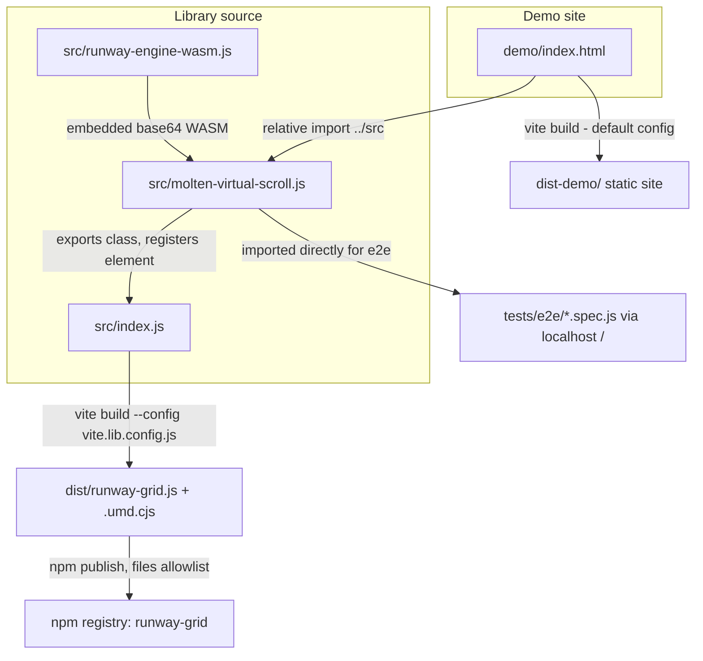

Now I'm listing the directory structure up to two levels deep to identify key files and folders, so I can understand the main components and their organization before exploring specific code areas.

I've mapped out the project: it's currently structured purely as a Vite demo (HTML page + dev server), with the actual reusable component living in `src/molten-virtual-scroll.js` and a Rust-compiled WASM engine embedded as base64 via `src/runway-engine-wasm.js`. Since the goal is to publish this as an npm package, I'm now going to check the `package.json` metadata, `.gitignore`, and how `dist/` is currently produced, so I can plan the restructuring needed to separate "library" from "demo" and add proper package publishing config.

I've confirmed how the WASM engine gets bundled into the JS component (base64-embedded, no separate binary needed) and noticed there's no dedicated library entry file that exports the `MoltenVirtualScroll` class - right now it's only usable as a side-effect import that self-registers as a custom element. Next I want to check the Rust crate naming and `runway_engine/pkg/package.json` metadata, then look at what's still missing in the root `package.json` (name, version, entry points, files list) so I can put together a concrete plan for restructuring this into a publishable npm package.

I've verified that several files in `src/assets` and `public` are unused leftovers from the original Vite template scaffold, so they can be removed as dead weight when preparing the package. Before finalizing the restructuring plan, I want to check with you on a couple of decisions that affect the repo layout and publish metadata - specifically whether to relocate the demo site into its own folder versus keeping it at the root, the license to include, and the desired npm package name.

Should the demo site (currently the root `index.html` + inline script) be moved into its own `demo/` folder to cleanly separate it from the publishable library source in `src/`?: Move demo to demo/
Which open-source license should be added for the npm package (a `LICENSE` file is currently missing, which is required/expected for public npm packages)?: Apache-2.0
What npm package name should be published (currently `package.json` still has the placeholder name `vite-starter`)? For example `molten-virtual-scroll` (matches the custom element tag) or a scoped name like `@yourorg/molten-virtual-scroll`.: runway-grid

**Requirements**

**Overview & Goals**  
Restructure the repository so `runway-grid` (the `<molten-virtual-scroll>` custom element, backed by the Rust/WASM `runway_engine`) can be published to npm as a standalone, installable package, while keeping the existing live demo (`index.html` with its 3 examples) and the full Playwright e2e suite intact and passing.

**Scope**  
**In Scope**
- Separate publishable library source (`src/`) from the demo site (moved to `demo/`).
- Add a proper library entry point that exports the `MoltenVirtualScroll` class (currently only registers itself as a side effect, nothing is exported).
- Add a dedicated library build (ESM + UMD) via Vite library mode, output to `dist/`.
- Add npm publishing metadata to `package.json` (`name: "runway-grid"`, remove `private`, `version`, `license: "Apache-2.0"`, `main`/`module`/`exports`, `files`, `sideEffects`, `keywords`, `description`).
- Add `LICENSE` (Apache-2.0) and a `README.md` documenting installation, usage, attributes/properties/methods/events.
- Remove unused leftover Vite-starter scaffolding (`src/style.css`, `src/assets/*`, `public/*`) confirmed unreferenced anywhere in the project.
- Guard `customElements.define(...)` against double-registration (important once the element can be imported by consumer bundlers in ways that may evaluate the module twice).

**Out of Scope**
- Renaming the custom element tag itself (`molten-virtual-scroll` stays as-is; only the npm package/repo name becomes `runway-grid`).
- Actually publishing to the npm registry (`npm publish`) - this plan prepares the package, publishing is a manual follow-up step.
- Adding TypeScript type declarations (not requested; can be a future enhancement).
- Changing any virtual-scroll behavior/logic in `molten-virtual-scroll.js` or the Rust engine.

**User Stories**
- As a package consumer, I want to run `npm install runway-grid` and `import 'runway-grid'` to get a working `<molten-virtual-scroll>` custom element without needing Rust/wasm-pack installed locally (the compiled WASM already ships embedded as base64 in the published JS).
- As a maintainer, I want the demo site and the library source clearly separated so publishing the npm package doesn't accidentally ship demo-only code/assets.
- As a contributor, I want `npm run dev` and `npm run test:e2e` to keep working exactly as before after the restructuring.

**Functional Requirements**
- `npm run build:lib` produces a `dist/` folder containing an ESM bundle (and a UMD bundle) that a consumer can import/script-tag directly.
- `npm run dev` / `npm run build` continue to serve/build the demo site (now living under `demo/`) exactly as before, with the 3 existing examples working unchanged.
- All 9 existing Playwright e2e tests continue to pass unmodified (they rely on `page.goto('/')` resolving to the demo page).
- `package.json` is publish-ready: no `private: true`, valid `name`/`version`/`license`, and a `files` allowlist that excludes `runway_engine/` Rust sources, `demo/`, `tests/`, and dev scripts from the published tarball.

**Technical Design**

**Current Implementation**
- `index.html` (root) is both the demo page **and** the Vite build entry point; it imports `./src/molten-virtual-scroll.js` directly as a side-effecting module script.
- `src/molten-virtual-scroll.js` defines `class MoltenVirtualScroll extends HTMLElement` (not exported) and unconditionally calls `customElements.define('molten-virtual-scroll', MoltenVirtualScroll)` at module load - no import/export API exists for consumers.
- `src/runway-engine-wasm.js` is an auto-generated module (via `scripts/generate-wasm-base64.mjs`) embedding the compiled Rust/WASM engine as a base64 string, so the published component is fully self-contained (no separate `.wasm` asset to serve).
- No `vite.config.js` exists; Vite runs in zero-config mode using root `index.html` as the sole entry, which is why demo and library currently can't be built/output independently.
- `package.json` has `"name": "vite-starter"`, `"private": true`, no `version` beyond `0.0.0`, no `license`/`main`/`exports`/`files` - none of it is publish-ready.
- `src/style.css`, `src/assets/{hero.png,javascript.svg,vite.svg}`, and `public/{favicon.svg,icons.svg}` are confirmed (via project-wide search) unreferenced by any HTML/JS/JSON file - leftover Vite-starter scaffolding.
- `playwright.config.js` starts the dev server via `npm run dev -- --port 5183 --strictPort` and all specs call `page.goto('/')`, relying on `/` resolving to the demo page.

**Key Decisions**
- **Demo relocated to `demo/`** (confirmed with user): `src/` becomes pure, publishable library source; `demo/index.html` (moved from root) becomes the example/showcase, imported via a relative path into `src/`. A root `vite.config.js` sets `root: 'demo'` so `npm run dev`/`npm run build` keep working exactly as before, and `/` still resolves to the demo page for Playwright.
- **License: Apache-2.0** (confirmed with user) - a `LICENSE` file is added at the repo root and referenced from `package.json`.
- **Package name: `runway-grid`** (confirmed with user) - used only for the npm package/repo identity; the custom element tag stays `<molten-virtual-scroll>` and the WASM engine stays `runway_engine`, so the naming family (`runway_engine` → `runway-grid`) stays consistent without touching existing markup/tests.
- **Two separate Vite build configs**: `vite.config.js` (demo, `root: 'demo'`, default app build) and a new `vite.lib.config.js` (library mode, entry `src/index.js`, outputs to `dist/`). Kept as two files (rather than one config branching on an env var) to keep each build's intent explicit and `npm run dev` trivially simple.
- **Library build formats: ESM + UMD** - ESM for modern bundlers/`<script type="module">`, UMD (global `RunwayGrid`) so the package also works from a plain `<script>` tag/CDN without a build step.

**Proposed Changes**
1. **Library entry point** - export the class and give the package a real public API surface:
```js
// src/molten-virtual-scroll.js (excerpt)
export class MoltenVirtualScroll extends HTMLElement { /* ...unchanged behavior... */ }

if (!customElements.get('molten-virtual-scroll')) {
  customElements.define('molten-virtual-scroll', MoltenVirtualScroll);
}
```
```js
// src/index.js (new)
export { MoltenVirtualScroll } from './molten-virtual-scroll.js';
```
2. **Demo relocation** - move `index.html` → `demo/index.html`; update its module import from `./src/molten-virtual-scroll.js` to `../src/molten-virtual-scroll.js`. Delete unused `src/style.css`, `src/assets/`, `public/` (confirmed dead).
3. **Vite configs**:
```js
// vite.config.js (demo dev/build - replaces zero-config mode)
export default defineConfig({
  root: 'demo',
  build: { outDir: '../dist-demo', emptyOutDir: true },
});
```
```js
// vite.lib.config.js (new - npm package build)
export default defineConfig({
  build: {
    lib: {
      entry: 'src/index.js',
      name: 'RunwayGrid',
      formats: ['es', 'umd'],
      fileName: (fmt) => `runway-grid.${fmt === 'es' ? 'js' : 'umd.cjs'}`,
    },
    outDir: 'dist',
    emptyOutDir: true,
  },
});
```
4. **`package.json` publish metadata**:
```json
{
  "name": "runway-grid",
  "version": "0.1.0",
  "description": "High-performance virtual scroll custom element (list & 2D grid) backed by a Rust/WASM layout engine",
  "license": "Apache-2.0",
  "type": "module",
  "main": "./dist/runway-grid.js",
  "module": "./dist/runway-grid.js",
  "exports": { ".": { "import": "./dist/runway-grid.js", "default": "./dist/runway-grid.js" } },
  "files": ["dist", "README.md", "LICENSE"],
  "sideEffects": true,
  "keywords": ["virtual-scroll", "web-component", "custom-element", "wasm", "grid"],
  "scripts": {
    "dev": "vite",
    "build": "vite build",
    "build:lib": "vite build --config vite.lib.config.js",
    "prepublishOnly": "npm run build:lib",
    "...": "existing build:wasm / build:wasm-base64 / build:engine / test:e2e stay unchanged"
  }
}
```
5. **`.gitignore`** - add `dist-demo` next to the existing `dist` entry (both remain build outputs, never committed).

**File Structure**
```
runway-grid/
├── src/                          # publishable library source
│   ├── index.js                  # NEW - public entry, exports MoltenVirtualScroll
│   ├── molten-virtual-scroll.js  # MODIFIED - class now exported, define() guarded
│   └── runway-engine-wasm.js     # unchanged (generated)
├── demo/                         # MOVED from root
│   └── index.html                # MOVED - import path updated to ../src/...
├── dist/                         # NEW build output (npm package, gitignored)
├── vite.config.js                # NEW - demo dev/build config (root: 'demo')
├── vite.lib.config.js            # NEW - library build config
├── LICENSE                       # NEW - Apache-2.0
├── README.md                     # NEW - install/usage/API docs
├── package.json                  # MODIFIED - publish metadata + scripts
├── runway_engine/                # unchanged (Rust source, excluded from npm tarball)
├── scripts/                      # unchanged (build:wasm, build:wasm-base64)
├── tests/e2e/                    # unchanged - still target `/` via baseURL
└── (removed) src/style.css, src/assets/, public/
```

**Architecture Diagram**


**Risks**
- Moving `index.html` changes Vite's `root`, which also changes where `public/` resolves from by default - mitigated by deleting the unused `public/` folder entirely rather than relocating it.
- Guarding `customElements.define` changes behavior if the element were ever legitimately redefined - safe here since redefinition was never supported/intended.
- `vite.lib.config.js` bundling `src/index.js` must not accidentally externalize or drop the base64 WASM import - verified by building and checking `dist/runway-grid.js` contains the embedded engine.

**Delivery Steps**

**Step 1: Relocate demo site into demo/ and add a dedicated demo Vite config**  
The demo site lives under `demo/` and `npm run dev` / `npm run build` serve/build it exactly as before, with all 3 examples working and Playwright's `page.goto('/')` still resolving correctly.
- Move `index.html` from the repo root to `demo/index.html`.
- Update its module script import from `./src/molten-virtual-scroll.js` to `../src/molten-virtual-scroll.js`.
- Add root `vite.config.js` with `root: 'demo'` and `build.outDir: '../dist-demo'` so the demo build no longer collides with the future library `dist/` output.
- Delete the unused, unreferenced leftovers: `src/style.css`, `src/assets/` (hero.png, javascript.svg, vite.svg), and `public/` (favicon.svg, icons.svg).
- Add `dist-demo` to `.gitignore` alongside the existing `dist` entry.
- Run `npm run dev` and the full `npm run test:e2e` suite to confirm all 9 existing Playwright specs still pass unmodified against the relocated demo.

**Step 2: Turn molten-virtual-scroll.js into a proper library entry point**  
The component's class is a real, importable public API instead of only a side-effecting custom element registration.
- Add `export` to `class MoltenVirtualScroll extends HTMLElement` in `src/molten-virtual-scroll.js`.
- Guard the registration: `if (!customElements.get('molten-virtual-scroll')) customElements.define('molten-virtual-scroll', MoltenVirtualScroll);`.
- Create `src/index.js` re-exporting `MoltenVirtualScroll` from `./molten-virtual-scroll.js` as the package's single public entry point.
- Verify the demo (`demo/index.html`) still imports and registers the element correctly after this change (no behavior change expected, purely additive exports).

**Step 3: Add the library build pipeline and npm publish metadata**  
`npm run build:lib` produces a distributable ESM + UMD bundle in `dist/`, and `package.json` is fully publish-ready under the name `runway-grid`.
- Add `vite.lib.config.js` with `build.lib` targeting `src/index.js`, `formats: ['es', 'umd']`, global name `RunwayGrid`, output to `dist/`.
- Update `package.json`: rename to `"runway-grid"`, remove `"private": true`, set `"version": "0.1.0"`, add `"description"`, `"license": "Apache-2.0"`, `"keywords"`, `"main"`/`"module"`/`"exports"` pointing at `dist/runway-grid.js`, `"files": ["dist", "README.md", "LICENSE"]`, `"sideEffects": true`.
- Add `"build:lib": "vite build --config vite.lib.config.js"` and `"prepublishOnly": "npm run build:lib"` scripts, leaving `build:wasm`/`build:wasm-base64`/`build:engine`/`test:e2e` untouched.
- Run `npm run build:lib` and confirm the generated `dist/runway-grid.js` includes the embedded base64 WASM engine (i.e. the bundle isn't accidentally missing `runway-engine-wasm.js`).

**Step 4: Add LICENSE and README documentation**  
The package has legal licensing in place and clear consumer-facing documentation for installing and using it.
- Add an `LICENSE` file at the repo root containing the Apache-2.0 license text.
- Add `README.md` covering: installation (`npm install runway-grid`), a minimal usage snippet (`import 'runway-grid'` + `<molten-virtual-scroll orientation="vertical">` markup), the public attributes (`orientation`, `row-size`, `col-size`, `buffer-size`), properties (`data`, `columns`, `template`), methods (`scrollToCell`, `scrollToIndex`), and the `rangechange` event.
- Link to the `demo/` folder / live examples for the 3 usage patterns (vertical list, 2D grid, horizontal list).


**Requirements**

**Overview & Goals**
Restructure the repository so `runway-grid` (the `<molten-virtual-scroll>` custom element, backed by the Rust/WASM `runway_engine`) can be published to npm as a standalone, installable package, while keeping the existing live demo (`index.html` with its 3 examples) and the full Playwright e2e suite intact and passing.

**Scope**
**In Scope**
- Separate publishable library source (`src/`) from the demo site (moved to `demo/`).
- Add a proper library entry point that exports the `MoltenVirtualScroll` class (currently only registers itself as a side effect, nothing is exported).
- Add a dedicated library build (ESM + UMD) via Vite library mode, output to `dist/`.
- Add npm publishing metadata to `package.json` (`name: "runway-grid"`, remove `private`, `version`, `license: "Apache-2.0"`, `main`/`module`/`exports`, `files`, `sideEffects`, `keywords`, `description`).
- Add `LICENSE` (Apache-2.0) and a `README.md` documenting installation, usage, attributes/properties/methods/events.
- Remove unused leftover Vite-starter scaffolding (`src/style.css`, `src/assets/*`, `public/*`) confirmed unreferenced anywhere in the project.
- Guard `customElements.define(...)` against double-registration (important once the element can be imported by consumer bundlers in ways that may evaluate the module twice).

**Out of Scope**
- Renaming the custom element tag itself (`molten-virtual-scroll` stays as-is; only the npm package/repo name becomes `runway-grid`).
- Actually publishing to the npm registry (`npm publish`) - this plan prepares the package, publishing is a manual follow-up step.
- Adding TypeScript type declarations (not requested; can be a future enhancement).
- Changing any virtual-scroll behavior/logic in `molten-virtual-scroll.js` or the Rust engine.

**User Stories**
- As a package consumer, I want to run `npm install runway-grid` and `import 'runway-grid'` to get a working `<molten-virtual-scroll>` custom element without needing Rust/wasm-pack installed locally (the compiled WASM already ships embedded as base64 in the published JS).
- As a maintainer, I want the demo site and the library source clearly separated so publishing the npm package doesn't accidentally ship demo-only code/assets.
- As a contributor, I want `npm run dev` and `npm run test:e2e` to keep working exactly as before after the restructuring.

**Functional Requirements**
- `npm run build:lib` produces a `dist/` folder containing an ESM bundle (and a UMD bundle) that a consumer can import/script-tag directly.
- `npm run dev` / `npm run build` continue to serve/build the demo site (now living under `demo/`) exactly as before, with the 3 existing examples working unchanged.
- All 9 existing Playwright e2e tests continue to pass unmodified (they rely on `page.goto('/')` resolving to the demo page).
- `package.json` is publish-ready: no `private: true`, valid `name`/`version`/`license`, and a `files` allowlist that excludes `runway_engine/` Rust sources, `demo/`, `tests/`, and dev scripts from the published tarball.

**Technical Design**

**Current Implementation**
- `index.html` (root) is both the demo page **and** the Vite build entry point; it imports `./src/molten-virtual-scroll.js` directly as a side-effecting module script.
- `src/molten-virtual-scroll.js` defines `class MoltenVirtualScroll extends HTMLElement` (not exported) and unconditionally calls `customElements.define('molten-virtual-scroll', MoltenVirtualScroll)` at module load - no import/export API exists for consumers.
- `src/runway-engine-wasm.js` is an auto-generated module (via `scripts/generate-wasm-base64.mjs`) embedding the compiled Rust/WASM engine as a base64 string, so the published component is fully self-contained (no separate `.wasm` asset to serve).
- No `vite.config.js` exists; Vite runs in zero-config mode using root `index.html` as the sole entry, which is why demo and library currently can't be built/output independently.
- `package.json` has `"name": "vite-starter"`, `"private": true`, no `version` beyond `0.0.0`, no `license`/`main`/`exports`/`files` - none of it is publish-ready.
- `src/style.css`, `src/assets/{hero.png,javascript.svg,vite.svg}`, and `public/{favicon.svg,icons.svg}` are confirmed (via project-wide search) unreferenced by any HTML/JS/JSON file - leftover Vite-starter scaffolding.
- `playwright.config.js` starts the dev server via `npm run dev -- --port 5183 --strictPort` and all specs call `page.goto('/')`, relying on `/` resolving to the demo page.

**Key Decisions**
- **Demo relocated to `demo/`** (confirmed with user): `src/` becomes pure, publishable library source; `demo/index.html` (moved from root) becomes the example/showcase, imported via a relative path into `src/`. A root `vite.config.js` sets `root: 'demo'` so `npm run dev`/`npm run build` keep working exactly as before, and `/` still resolves to the demo page for Playwright.
- **License: Apache-2.0** (confirmed with user) - a `LICENSE` file is added at the repo root and referenced from `package.json`.
- **Package name: `runway-grid`** (confirmed with user) - used only for the npm package/repo identity; the custom element tag stays `<molten-virtual-scroll>` and the WASM engine stays `runway_engine`, so the naming family (`runway_engine` → `runway-grid`) stays consistent without touching existing markup/tests.
- **Two separate Vite build configs**: `vite.config.js` (demo, `root: 'demo'`, default app build) and a new `vite.lib.config.js` (library mode, entry `src/index.js`, outputs to `dist/`). Kept as two files (rather than one config branching on an env var) to keep each build's intent explicit and `npm run dev` trivially simple.
- **Library build formats: ESM + UMD** - ESM for modern bundlers/`<script type="module">`, UMD (global `RunwayGrid`) so the package also works from a plain `<script>` tag/CDN without a build step.

**Proposed Changes**
1. **Library entry point** - export the class and give the package a real public API surface:
```js
// src/molten-virtual-scroll.js (excerpt)
export class MoltenVirtualScroll extends HTMLElement { /* ...unchanged behavior... */ }

if (!customElements.get('molten-virtual-scroll')) {
  customElements.define('molten-virtual-scroll', MoltenVirtualScroll);
}
```
```js
// src/index.js (new)
export { MoltenVirtualScroll } from './molten-virtual-scroll.js';
```
2. **Demo relocation** - move `index.html` → `demo/index.html`; update its module import from `./src/molten-virtual-scroll.js` to `../src/molten-virtual-scroll.js`. Delete unused `src/style.css`, `src/assets/`, `public/` (confirmed dead).
3. **Vite configs**:
```js
// vite.config.js (demo dev/build - replaces zero-config mode)
export default defineConfig({
  root: 'demo',
  build: { outDir: '../dist-demo', emptyOutDir: true },
});
```
```js
// vite.lib.config.js (new - npm package build)
export default defineConfig({
  build: {
    lib: {
      entry: 'src/index.js',
      name: 'RunwayGrid',
      formats: ['es', 'umd'],
      fileName: (fmt) => `runway-grid.${fmt === 'es' ? 'js' : 'umd.cjs'}`,
    },
    outDir: 'dist',
    emptyOutDir: true,
  },
});
```
4. **`package.json` publish metadata**:
```json
{
  "name": "runway-grid",
  "version": "0.1.0",
  "description": "High-performance virtual scroll custom element (list & 2D grid) backed by a Rust/WASM layout engine",
  "license": "Apache-2.0",
  "type": "module",
  "main": "./dist/runway-grid.js",
  "module": "./dist/runway-grid.js",
  "exports": { ".": { "import": "./dist/runway-grid.js", "default": "./dist/runway-grid.js" } },
  "files": ["dist", "README.md", "LICENSE"],
  "sideEffects": true,
  "keywords": ["virtual-scroll", "web-component", "custom-element", "wasm", "grid"],
  "scripts": {
    "dev": "vite",
    "build": "vite build",
    "build:lib": "vite build --config vite.lib.config.js",
    "prepublishOnly": "npm run build:lib",
    "...": "existing build:wasm / build:wasm-base64 / build:engine / test:e2e stay unchanged"
  }
}
```
5. **`.gitignore`** - add `dist-demo` next to the existing `dist` entry (both remain build outputs, never committed).

**File Structure**
```
runway-grid/
├── src/                          # publishable library source
│   ├── index.js                  # NEW - public entry, exports MoltenVirtualScroll
│   ├── molten-virtual-scroll.js  # MODIFIED - class now exported, define() guarded
│   └── runway-engine-wasm.js     # unchanged (generated)
├── demo/                         # MOVED from root
│   └── index.html                # MOVED - import path updated to ../src/...
├── dist/                         # NEW build output (npm package, gitignored)
├── vite.config.js                # NEW - demo dev/build config (root: 'demo')
├── vite.lib.config.js            # NEW - library build config
├── LICENSE                       # NEW - Apache-2.0
├── README.md                     # NEW - install/usage/API docs
├── package.json                  # MODIFIED - publish metadata + scripts
├── runway_engine/                # unchanged (Rust source, excluded from npm tarball)
├── scripts/                      # unchanged (build:wasm, build:wasm-base64)
├── tests/e2e/                    # unchanged - still target `/` via baseURL
└── (removed) src/style.css, src/assets/, public/
```

**Architecture Diagram**


**Risks**
- Moving `index.html` changes Vite's `root`, which also changes where `public/` resolves from by default - mitigated by deleting the unused `public/` folder entirely rather than relocating it.
- Guarding `customElements.define` changes behavior if the element were ever legitimately redefined - safe here since redefinition was never supported/intended.
- `vite.lib.config.js` bundling `src/index.js` must not accidentally externalize or drop the base64 WASM import - verified by building and checking `dist/runway-grid.js` contains the embedded engine.

**Delivery Steps**

**Step 1: Relocate demo site into demo/ and add a dedicated demo Vite config**
The demo site lives under `demo/` and `npm run dev` / `npm run build` serve/build it exactly as before, with all 3 examples working and Playwright's `page.goto('/')` still resolving correctly.
- Move `index.html` from the repo root to `demo/index.html`.
- Update its module script import from `./src/molten-virtual-scroll.js` to `../src/molten-virtual-scroll.js`.
- Add root `vite.config.js` with `root: 'demo'` and `build.outDir: '../dist-demo'` so the demo build no longer collides with the future library `dist/` output.
- Delete the unused, unreferenced leftovers: `src/style.css`, `src/assets/` (hero.png, javascript.svg, vite.svg), and `public/` (favicon.svg, icons.svg).
- Add `dist-demo` to `.gitignore` alongside the existing `dist` entry.
- Run `npm run dev` and the full `npm run test:e2e` suite to confirm all 9 existing Playwright specs still pass unmodified against the relocated demo.

**Step 2: Turn molten-virtual-scroll.js into a proper library entry point**
The component's class is a real, importable public API instead of only a side-effecting custom element registration.
- Add `export` to `class MoltenVirtualScroll extends HTMLElement` in `src/molten-virtual-scroll.js`.
- Guard the registration: `if (!customElements.get('molten-virtual-scroll')) customElements.define('molten-virtual-scroll', MoltenVirtualScroll);`.
- Create `src/index.js` re-exporting `MoltenVirtualScroll` from `./molten-virtual-scroll.js` as the package's single public entry point.
- Verify the demo (`demo/index.html`) still imports and registers the element correctly after this change (no behavior change expected, purely additive exports).

**Step 3: Add the library build pipeline and npm publish metadata**
`npm run build:lib` produces a distributable ESM + UMD bundle in `dist/`, and `package.json` is fully publish-ready under the name `runway-grid`.
- Add `vite.lib.config.js` with `build.lib` targeting `src/index.js`, `formats: ['es', 'umd']`, global name `RunwayGrid`, output to `dist/`.
- Update `package.json`: rename to `"runway-grid"`, remove `"private": true`, set `"version": "0.1.0"`, add `"description"`, `"license": "Apache-2.0"`, `"keywords"`, `"main"`/`"module"`/`"exports"` pointing at `dist/runway-grid.js`, `"files": ["dist", "README.md", "LICENSE"]`, `"sideEffects": true`.
- Add `"build:lib": "vite build --config vite.lib.config.js"` and `"prepublishOnly": "npm run build:lib"` scripts, leaving `build:wasm`/`build:wasm-base64`/`build:engine`/`test:e2e` untouched.
- Run `npm run build:lib` and confirm the generated `dist/runway-grid.js` includes the embedded base64 WASM engine (i.e. the bundle isn't accidentally missing `runway-engine-wasm.js`).

**Step 4: Add LICENSE and README documentation**
The package has legal licensing in place and clear consumer-facing documentation for installing and using it.
- Add an `LICENSE` file at the repo root containing the Apache-2.0 license text.
- Add `README.md` covering: installation (`npm install runway-grid`), a minimal usage snippet (`import 'runway-grid'` + `<molten-virtual-scroll orientation="vertical">` markup), the public attributes (`orientation`, `row-size`, `col-size`, `buffer-size`), properties (`data`, `columns`, `template`), methods (`scrollToCell`, `scrollToIndex`), and the `rangechange` event.
- Link to the `demo/` folder / live examples for the 3 usage patterns (vertical list, 2D grid, horizontal list).